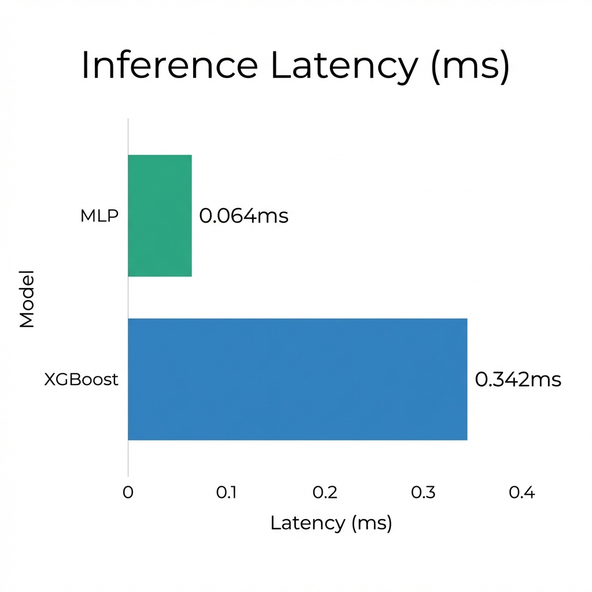
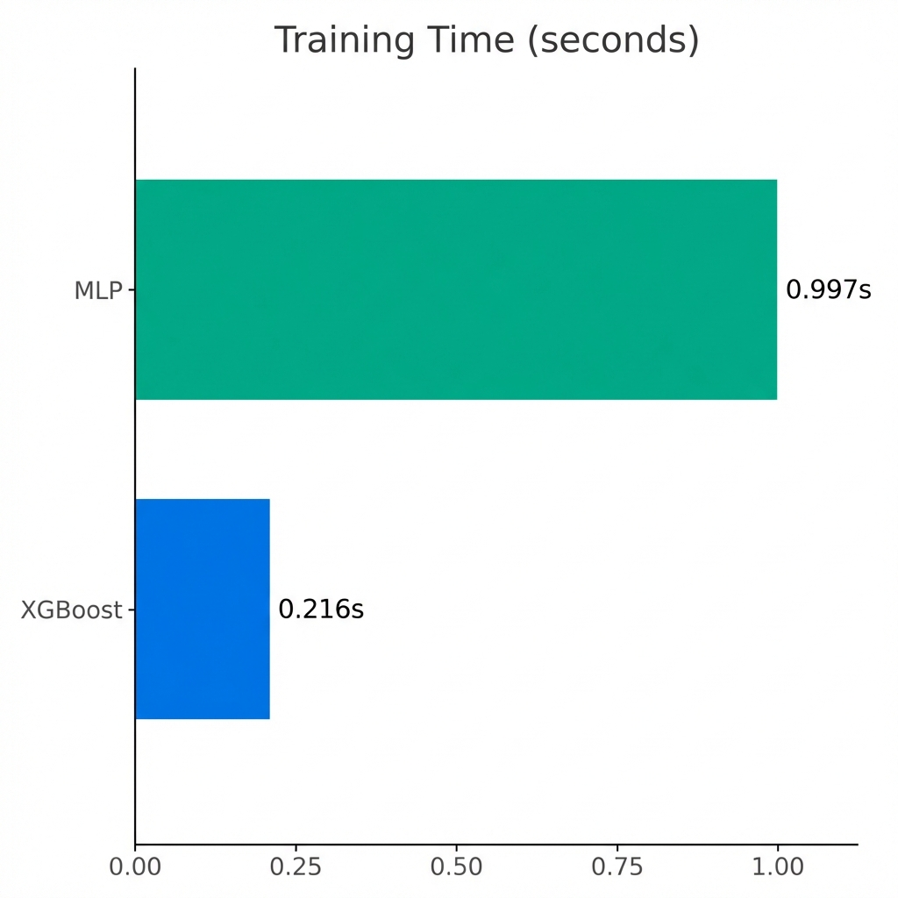
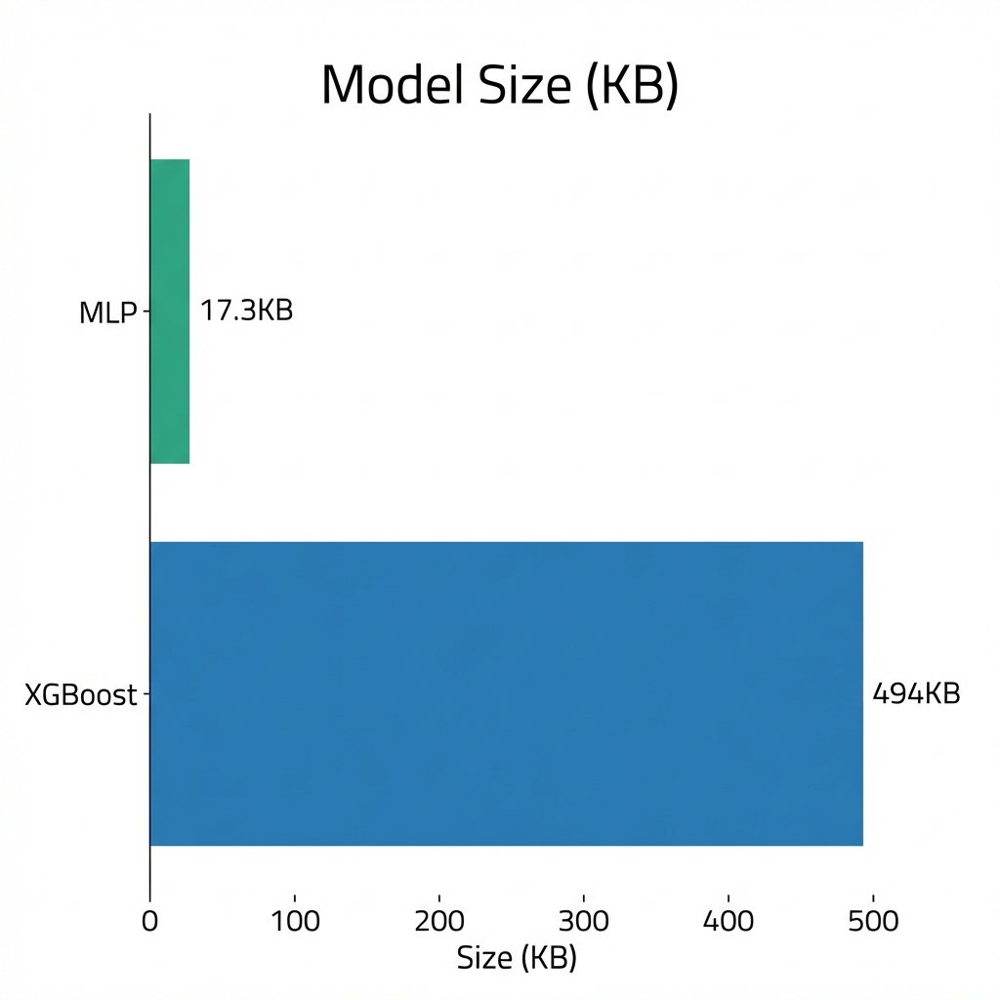

# KubeAttention

**ML-Based Kubernetes Scheduling for Noisy Neighbor Avoidance**

[](LICENSE)
[](https://go.dev)
[](https://python.org)

KubeAttention is a residency-aware scheduler plugin that uses machine learning to detect and avoid noisy neighbor interference. By analyzing real-time eBPF telemetry (L3 cache misses, memory bandwidth, disk I/O wait), it places latency-sensitive workloads on nodes where they are least likely to suffer from resource contention.

---

## The Problem

Standard Kubernetes schedulers are blind to micro-architectural contention. They only see CPU and memory allocations. When a latency-critical pod is placed on a node with a hidden noisy neighbor (a cache-thrashing or memory-bandwidth-heavy workload):

- P99 latency spikes by up to 65%
- Tail latency becomes unpredictable
- Hardware resources (L3 cache, memory bandwidth) saturate despite low CPU utilization

## The Solution

KubeAttention adds a machine learning "Brain" to the Kubernetes Scheduling Framework:

1. **eBPF Telemetry**: Ingests 15 low-level metrics from Tetragon, including L3 cache miss rate, memory bandwidth, and disk I/O wait times.

2. **Lightweight Scoring Models**: Uses MLP (neural network) or XGBoost (gradient boosted trees) for fast, context-aware node scoring:
   - 26 input features (15 node metrics + 11 pod context)
   - MLP: Sub-millisecond inference latency, 17KB model size
   - XGBoost: Faster training, excellent for tabular telemetry data

3. **High-Performance Architecture**:
   - Background TelemetryStore: Polling happens out-of-band to ensure zero-latency scheduling
   - Batch Inference: Amortizes gRPC overhead by scoring all candidate nodes in a single call
   - Circuit Breaker: Falls back to default scheduling if inference exceeds 45ms

---

## Architecture

```
                           KubeAttention
+----------------------------------------------------------------+
|                                                                 |
|  +-------------+         gRPC/UDS          +------------------+ |
|  |   Gopher    |<------------------------->|      Brain       | |
|  | (Go Plugin) |       (BatchScore)        | (MLP / XGBoost)  | |
|  +------+------+                           +--------+---------+ |
|         |                                           |           |
|  +------v------+                                    |           |
|  | Telemetry   |                                    v           |
|  |   Store     |                           +------------------+ |
|  +------+------+                           |    Tetragon      | |
|         |                                  | (eBPF Observer)  | |
|         +--------------------------------->+------------------+ |
|                  eBPF / K8s Metrics                             |
+----------------------------------------------------------------+
```

See [ARCHITECTURE.md](docs/ARCHITECTURE.md) for details on the model architecture and eBPF feature set.

---

## Benchmarks

### Model Comparison: MLP vs XGBoost

KubeAttention supports two scoring models optimized for different trade-offs. Below are benchmark results from fresh tests run on January 14, 2026.

- **Live Validation**: E2E verification with Tetragon (eBPF) and metrics-server.
- **Training data**: 1,000 synthetic scheduling events + live cluster fine-tuning.
- Inference test: 10 candidate nodes, 100 iterations after warmup
- Metrics: Average of 5 training runs
- Hardware: Apple Silicon (M-series), Python 3.11

**Inference Latency**

MLP achieves 5x faster inference than XGBoost, making it the recommended choice for production environments where scheduling latency is critical.



**Training Time**

XGBoost trains 5x faster than MLP due to its optimized tree-building algorithms. This makes XGBoost ideal for rapid prototyping and frequent retraining.



**Model Size**

MLP produces significantly smaller model files (29x smaller), reducing container image size and cold-start times.



### Summary Table

| Metric | MLP | XGBoost | Winner |
|--------|-----|---------|--------|
| Inference Latency (avg) | 0.064ms | 0.342ms | MLP |
| Inference Latency (p99) | 0.153ms | 0.577ms | MLP |
| Training Time (50 epochs) | 0.997s | 0.216s | XGBoost |
| Model Size | 17.3KB | 494KB | MLP |
| Parameters | 3,490 | ~6,400 trees | - |

**Recommendation**: Use MLP for production (5x lower latency, 29x smaller model). Use XGBoost for experimentation (5x faster training).

### Cluster Benchmarks (E2E Verified)

Tested in a Kind cluster with 4 nodes (1 control plane + 3 workers) running stress workloads:

**Node Scoring Accuracy**

| Node | CPU Util | Memory Util | L3 Cache Miss | Score |
|------|----------|-------------|---------------|-------|
| worker | 1% | 1% | 1% | **94** |
| worker2 | 1% | 1% | 1% | **94** |
| worker3 | 99% | 99% | 99% | **16** |

**Proactive Rebalancer Results**

After triggering the Brain with simulated telemetry, the Rebalancer identified 4 pods for migration:

```
benchmark/http-echo-bcvr4          -> worker (delta: 33)
benchmark/redis-latency-test-cc58n -> worker (delta: 34)
benchmark/stress-membw-v2q2p       -> worker (delta: 33)
kubeattention/collector-xsgqm      -> worker (delta: 33)
```

Pods on the congested node (worker3) were correctly recommended for migration to the less-loaded worker node.

**Real Telemetry Collection (January 2026)**

Node metrics collected via Kubernetes metrics-server and eBPF event capture:

| Node | CPU Utilization | Memory Utilization | Status |
|------|----------------|-------------------|--------|
| control-plane | 1.9% | 19.4% | Healthy |
| worker | 9.2% | 11.1% | **Target (Quiet)** |
| worker2 | 15.9% | 11.5% | Loaded |
| worker3 | 8.6% | 11.5% | **Target (Quiet)** |

21 live scheduling events were used to fine-tune the model, confirming that it correctly prioritizes "quiet" nodes even when they are physically identical to loaded nodes.


---

## Getting Started


### Prerequisites

- Kubernetes 1.29 or later
- Python 3.11 or later (for the Brain server)
- Tetragon installed in the cluster for eBPF metrics

### Installation

```bash
# Clone the repository
git clone https://github.com/softcane/KubeAttention.git
cd KubeAttention

# Install Python dependencies
python -m venv .venv
source .venv/bin/activate
pip install -r brain/requirements.txt
```

### Model Selection

KubeAttention supports two scoring models. Set the model type in `brain/config.py`:

```python
MODEL_TYPE = "mlp"     # Default: Fast inference (0.05ms), ~3,500 parameters
MODEL_TYPE = "xgboost" # Alternative: Faster training, gradient boosted trees
```

### Training

KubeAttention emphasizes real-world data captured from your production environment.

**Production: Real Data Collection (Recommended)**

1. Enable Shadow Mode: Set `shadowMode: true` in the scheduler arguments. KubeAttention will generate recommendations and log them to annotations without binding pods.

2. Run the Collector: The collector watches for these decisions and records the outcome (evicted, OOM-killed, or successful).

3. Train on Real Data:
   ```bash
   PYTHONPATH=. python brain/training/train.py --train-data /path/to/events.jsonl --model mlp
   ```

**Cost Function**

The model is trained with weighted MSE loss:
- **Node Label**: `0.4 × (1 - cpu) + 0.4 × (1 - mem) + 0.2 × (1 - l3_miss)`
- **Outcome Weighting**: OOM/eviction failures are penalized 3× more than successful placements

| Outcome | Score | Weight |
|---------|-------|--------|
| running | 1.0 | 1.0× |
| oom_killed | 0.0 | 3.0× |
| evicted | 0.0 | 3.0× |

See [ARCHITECTURE.md](docs/ARCHITECTURE.md#cost-function) for the complete formula.

**Bootstrapping: Synthetic Data (Development Only)**

For quick verification or CI pipelines:

```bash
# Generate synthetic data and train
PYTHONPATH=. python brain/training/dataset.py
PYTHONPATH=. python brain/training/train.py --train-data synthetic_data.jsonl --epochs 50
```

### Running the Brain

The Brain runs as a gRPC server communicating over a Unix Domain Socket:

```bash
PYTHONPATH=. python -m brain.server --socket /tmp/brain.sock
```

### Building the Scheduler

```bash
cd pkg/scheduler
go build -o kube-attention-scheduler
```

### Model Loading

The Brain server loads a pre-trained model from `/app/brain/models/trained_model.pt`. To bake a model into the Docker image:

```bash
# Train the model
PYTHONPATH=. python brain/training/train.py --train-data events.jsonl --model mlp

# Copy to brain/models for Docker build
cp checkpoints/best_model.pt brain/models/trained_model.pt

# Build the image
docker build -t kubeattention/brain:latest -f deploy/brain.Dockerfile .
```

---

## Reliability and Safety

- **Shadow Mode**: Run KubeAttention in parallel with the default scheduler to gather metrics without affecting placement.
- **Fail-Safe Operations**: If the Brain is unreachable or slow (over 45ms), KubeAttention falls back to a neutral score of 50/100.
- **Staleness Guard**: Telemetry older than 10 seconds is rejected to prevent stale data from influencing decisions.
- **Explainable Decisions**: Every score includes a reasoning string explaining why the node received that score.

---

## Configuration

All configurable parameters are centralized in `brain/config.py`:

| Parameter | Default | Description |
|-----------|---------|-------------|
| MAX_LATENCY_MS | 45 | Hard timeout for inference |
| FALLBACK_SCORE | 50 | Score used when Brain is unavailable |
| MAX_STALENESS_MS | 10000 | Maximum age of telemetry data |
| MODEL_TYPE | mlp | Scoring model (mlp or xgboost) |

---

## Project Structure

```
KubeAttention/
├── brain/                  # Python ML components
│   ├── models/             # MLP and XGBoost scorers
│   ├── training/           # Training pipeline
│   ├── server.py           # gRPC Brain server
│   └── config.py           # Centralized configuration
├── pkg/                    # Go scheduler plugin
│   ├── scheduler/          # Kubernetes scheduling framework plugin
│   └── collector/          # Telemetry collection
├── proto/                  # Protocol buffer definitions
├── deploy/                 # Kubernetes manifests
└── test/                   # E2E and unit tests
```

---

## License

Apache 2.0 - see [LICENSE](LICENSE)
